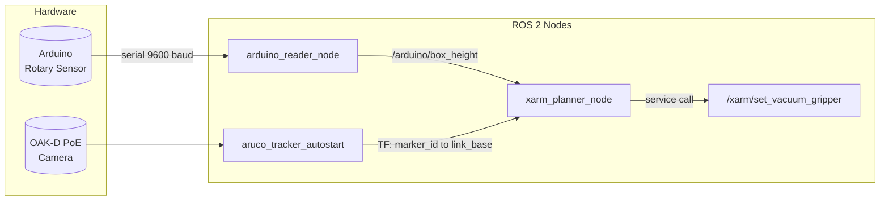
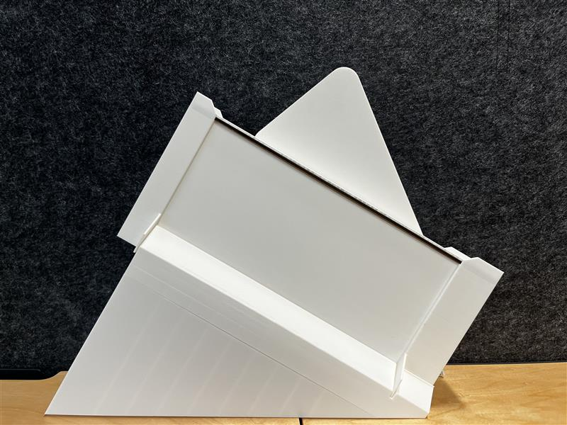

# Mosaic Night Pharmacy — ROB & HANS

An automated after-hours pharmacy dispensing prototype that combines a 6-DOF robotic arm, computer vision, and an Arduino-based height sensor to locate, pick, and deliver boxed medicine without human intervention.

Built for the M.Sc. in Interdisciplinary Computing at IT:U Austria.

> **Note:** This is a course project and research prototype. The goal is clarity and reproducibility rather than production readiness.

---

## Table of Contents

- [System Overview](#system-overview)
- [Hardware](#hardware)
- [Software Prerequisites](#software-prerequisites)
- [Architecture](#architecture)
- [Operational Workflow](#operational-workflow)
- [Box Height Calibration](#box-height-calibration)
- [How to Run](#how-to-run)
- [Repository Layout](#repository-layout)
- [Media](#media)
- [Limitations](#limitations)
- [License](#license)
- [Authors](#authors)

---

## System Overview

A customer requests a medicine by name. The operator selects the corresponding ArUco marker ID via the command line. The system then:

1. Measures the box height using a rotary sensor on the storage platform.
2. Locates the box visually through an ArUco marker tracked by the OAK-D PoE camera.
3. Plans and executes a pick-and-place trajectory with the xArm6 robotic arm.
4. Deposits the box at a dispensing point, using the measured height to calculate a safe drop-off position.

---

## Hardware

| Component | Details |
| --- | --- |
| Robotic arm | UFactory xArm6 (6 DOF), IP `192.168.1.196` |
| End effector | Vacuum gripper (suction-based pick-up) |
| Camera | OAK-D PoE (ArUco marker detection) |
| Sensor | Arduino with rotary potentiometer on analog pin A0 |
| Communication | Serial (Arduino, 9600 baud) and Ethernet (xArm, OAK-D) |

---

## Software Prerequisites

| Dependency | Purpose |
| --- | --- |
| ROS 2 | Middleware for inter-node communication and TF |
| MoveIt 2 + OMPL | Motion planning and trajectory execution |
| MoveItPy | Python bindings for MoveIt 2 |
| `uf_ros_lib` | UFactory xArm ROS 2 driver and configuration builder |
| `xarm_msgs` | xArm-specific service definitions (vacuum gripper control) |
| `bitbots_tf_buffer` | Enhanced TF2 buffer for reliable transform lookups |
| PySerial | Serial communication with the Arduino |
| ArUco tracker node | External node that publishes marker TF frames (e.g. `aruco_tracker_autostart`) |

---

## Architecture

### ROS 2 Node Table

| Node | Source | Role | Publishes | Subscribes | Services | Parameters |
| --- | --- | --- | --- | --- | --- | --- |
| `arduino_reader_node` | `arduino_reader.py` | Reads the rotary sensor via serial and converts angle to box height | `/arduino/rotary_angle` (Float32), `/arduino/box_height` (Float32), `/arduino/medicine` (String) | — | — | `serial_port`, `baud_rate`, `timeout`, `publish_rate` |
| `xarm_planner_node` | `movement.py` | Plans and executes the pick-and-place motion | — | `/arduino/box_height` (Float32) | `/xarm/set_vacuum_gripper` (VacuumGripperCtrl) | `marker_id` (required) |
| `aruco_tracker_autostart` | external | Detects ArUco markers and broadcasts their TF frames | TF: `marker_<id>` → `link_base` | camera image stream | — | — |

### TF Frames

- `link_base` — robot base (world-fixed)
- `link_tcp` — tool center point (vacuum gripper)
- `marker_<id>` — ArUco marker on the target box (published by the camera tracker)

### Communication Diagram



---

## Operational Workflow

The sequence executed by `movement.py` when a marker ID is provided:

| Phase | What happens | Key method |
| --- | --- | --- |
| 1. Initialisation | Connect to xArm, set up TF listener, deactivate vacuum gripper | `TestMoveIt.__init__()`, `vacuum_activator(False)` |
| 2. Observe | Arm moves to the `look-diagonal` pose | `go_to_default("look-diagonal")` |
| 3. Measure | Read the box height from the Arduino rotary sensor (default 180 mm if unavailable) | `get_box_height()` |
| 4. Locate | Look up the TF transform from `link_base` to the target marker | `go_to_aruco()` |
| 5. Approach | Move to the marker position with Y +0.1 m and Z -0.05 m offsets, then fine-adjust relative to TCP | `move_relative_to_tcp(0.013, 0.0, 0.101)` |
| 6. Pick | Activate vacuum gripper, then lift the box sideways (+0.1 m Y) and upward (-0.3 m Z) | `vacuum_activator(True)`, `move_relative_to_tcp(...)` |
| 7. Transport | Move to the `look-down` pose above the dispensing area | `go_to_default("look-down")` |
| 8. Dispense | Lower to a height equal to `box_height + 10 mm` clearance, then release | `go_to_position(0, 0.44, drop_z)`, `vacuum_activator(False)` |

---

## Box Height Calibration

The Arduino reads a raw analog value from the rotary potentiometer, maps it to an angle (0–300 degrees), and sends it over serial. The ROS 2 node `arduino_reader_node` converts the angle to a box height using a quadratic regression fitted to five calibration points:

| Angle (degrees) | Measured box height (mm) |
| --- | --- |
| 66 | 49 |
| 92 | 105 |
| 93 | 111 |
| 98 | 146 |
| 102 | 190 |

**Fitted equation (R source: `arduino_reader.py`):**

```
height_mm = 0.176090 * angle² − 25.7267 * angle + 980.0084
```

The angle is clamped to the calibrated range [66, 102] degrees before conversion. The resulting height in metres is published on `/arduino/box_height` and used by `movement.py` to calculate the drop-off position.

---

## How to Run

### 1. Source the workspace

```bash
source /opt/ros/jazzy/setup.bash
source ~/ros2_ws/install/setup.bash
```
This project was entirely done on Jazzy; there's no certainty on how it would behave on other distributions.

### 2. Launch the OAK-D PoE camera

```bash
ros2 launch depthai_ros_driver camera_as_part_of_a_robot.launch.py
```

### 3. Launch the xArm with MoveIt 2

```bash
ros2 launch xarm_moveit_config xarm6_moveit_realmove.launch.py \
  robot_ip:=192.168.1.196 \
  add_vacuum_gripper:=true \
  limited:=false \
  add_oakd_poe:=true
```

### 4. Start the ArUco tracker

```bash
ros2 run aruco_opencv aruco_tracker_autostart --ros-args \
  -p cam_base_topic:=oak/rgb/image_raw \
  -p marker_size:=0.02
```

The tracker must be running and publishing TF frames before starting the movement node.
Adjust `marker_size` according to the size you have printed your markers.

### 5. Start the Arduino sensor node

```bash
ros2 run mosaic_package arduino_reader
```

To override defaults:

```bash
ros2 run mosaic_package arduino_reader --ros-args \
  -p serial_port:=/dev/ttyUSB0 \
  -p baud_rate:=9600 \
  -p publish_rate:=20.0
```

### 6. Run the pick-and-place sequence

```bash
ros2 run mosaic_package movement --ros-args -p marker_id:=marker_0
```

Replace `marker_0` with the ArUco marker ID corresponding to the desired medicine box.

### Verifying data flow

```bash
# In a separate terminal
ros2 topic echo /arduino/rotary_angle
ros2 topic echo /arduino/box_height
```

For detailed Arduino wiring and troubleshooting, see [`mosaic_package/ARDUINO_SETUP.md`](mosaic_package/ARDUINO_SETUP.md).

---

## Repository Layout

```
Mosaic-Night-Pharmacy/
├── README.md
├── LICENSE                          # MIT License
├── docs/
│   └── media/                       # Photos and videos of the prototype
├── mosaic_package/                   # ROS 2 Python package
│   ├── mosaic_package/
│   │   ├── arduino_reader.py        # Arduino sensor node (serial → ROS 2 topics)
│   │   ├── movement.py              # xArm pick-and-place node (MoveIt 2)
│   │   ├── original_movement.py     # Earlier version without Arduino height integration - left there for satefy reasons and deadline approximation
│   │   ├── mosaic_node.py           # Minimal placeholder node
│   │   └── control_logic.py         # Reserved for future control logic
│   ├── arduino_sketch_example.ino   # Example Arduino firmware for the rotary sensor
│   ├── xarm_params.yaml             # xArm service enable/disable configuration
│   ├── ARDUINO_SETUP.md             # Arduino wiring and ROS 2 integration guide
│   ├── setup.py                     # Python package setup with entry points
│   ├── package.xml                  # ROS 2 package manifest
│   └── test/                        # Code style checks (flake8, pep257, copyright)
```

---

## Media

### Storage System


### System in Action
[](docs/media/working-mechanism.mp4)

---

## Limitations

- **Prototype only** — functional for lab demonstrations, not hardened for deployment.
- **Single box at a time** — no batch or queue-based dispensing.
- **Manual marker selection** — the operator must specify the marker ID; there is no inventory management system.
- **Hardcoded network** — the xArm IP address is set in source code.
- **Calibration range** — box height conversion is only valid for the five calibrated points (49–190 mm).

---

## License

This project is licensed under the [MIT License](LICENSE).

---

## Authors

<!-- Replace with your team members -->
- Avneet Kaur
- Ninar Alsaed
- Pedro Marin Sekine

M.Sc. in Interdisciplinary Computing, IT:U Austria, 2026
